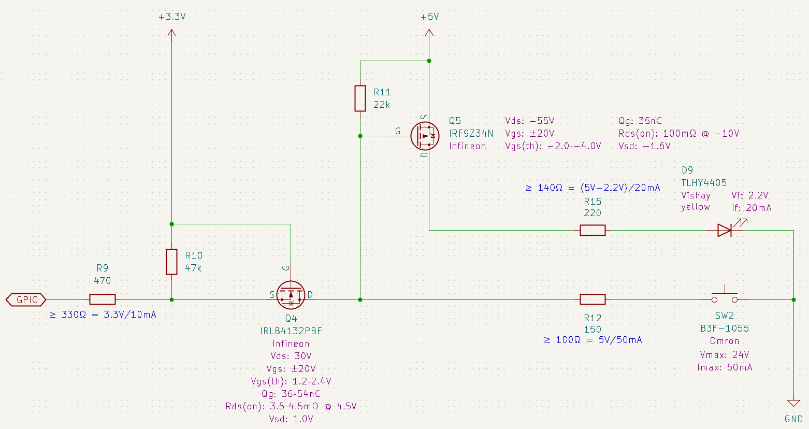
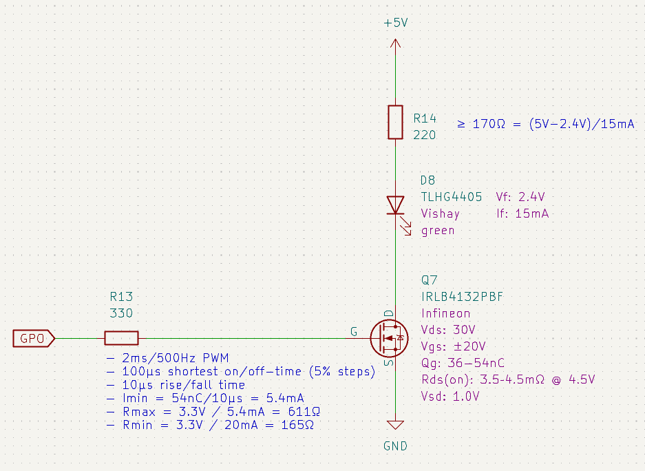
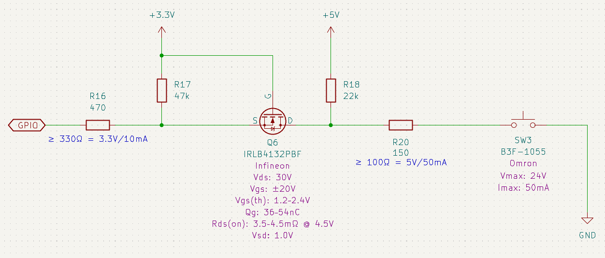
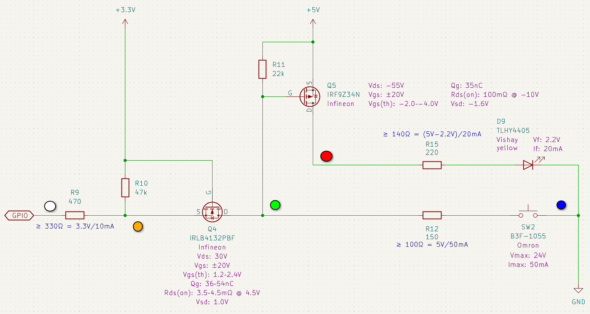
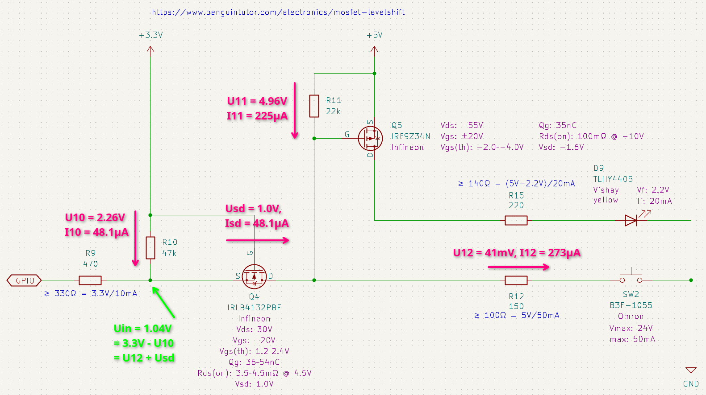

# Hardware Implementation — Breadboard Test Setup

The test setup on the breadboard uses
- Infineon NMOS IRLB4132PBF for level shifting and low-side switching
- Infineon PMOS IRF9Z34N for high-side switching

The only reason for this choice was that they had been a few spare parts on stock in the workshop and that they can be
easily mounted on a breadboard.

## Design

### Combined Input/Output with Level Shifter and High-Side Switching

### PWM Output with Low-Side Switching

### Input Only with Level Shifter

## Test Setup for Combined Input/Output

The test setup uses probe pins as shown in the following figure

The following table lists the expected voltage levels at the probes depending on state of the switch and the GPIO.
The calculation for the expected voltage level are shown in the following subsections.

| Probe Color | Remark                   | Idle (V) | SW Pressed (V) | GPIO active (V) | SW pressed, GPIO active (V) |
|:------------|:-------------------------|---------:|---------------:|----------------:|----------------------------:|
| Blue        | Button Ground            |     0.00 |           0.00 |            0.00 |                        0.00 |
| Green       | NMOS-D and PMOS-G, resp. |     5.00 |           0.04 |            0.14 |                        0.03 |
| Orange      | NMOS-S                   |     3.30 |           1.04 |            0.13 |                        0.03 |
| White       | GPIO 11                  |     3.30 |           1.04 |            0.00 |                        0.00 |
| Red         | PMOS-D                   |     0.00 |           4.98 |            4.98 |                        4.98 |

### SW Pressed, GPIO floating (high-impedance)

**Assumptions:**
- As the GPIO is floating, resistor R9 isn't considered.
  The voltage level at white and orange are assumed to be equal.
- The current flows across the body diode of the NMOS from orange to blue (reversed to the normal direction).
  The voltage drop across the body diode is 1.0 V acc. to datasheet.

**Constraints:**
- U12 + 1.0 V + U10 = 3.3 V
- U12 + U11 = 5.0 V
- U10 = 47 kΩ × I10
- U11 = 22 kΩ × I11
- U12 = 150 Ω × I12
- I10 + I11 = I12

**Solution:**
- U10 ≈ 2.26 V
- U11 ≈ 4.96 V
- U12 ≈ 41.0 mV
- I10 ≈  48.1 µA
- I11 ≈ 225 µA
- I12 ≈ 273 µA

Us = 3.3 V - U10 = 1.0 V + U12 = 1.04 V

### GPIO low, SW floating

**Target:** Voltage at NMOS-D (Green)

**Constraints:**
- U9 + U10 = 3.3 V
- U9 + Usd + U11 = 5 V
- U9  = 470 Ω × I9
- U10 = 47 kΩ × I10
- Usd = 10 mΩ × I11
- U11 = 22 kΩ × I11
- I10 + I11 = I9

**Solution:**
- U9 ≈ 0.13 V
- U10 ≈ 3.16 V
- U11 ≈ 4.86 V
- Usd ≈ 2.21 µV
- I9 ≈ 288 µA
- I10 ≈ 67 µA
- I11 ≈ 221 µA

Ud = 5.0 V - U11 = 0.14 V

### SW Pressed, GPIO low

**Target:** Voltage at NMOS-D (Green)

**Constraints:**
- U9 + U10 = 3.3 V
- U9 + Usd  = U12
- U12 + U11 = 5 V
- U9  = 470 Ω × I9
- U10 = 47 kΩ × I10
- U11 = 22 kΩ × I11
- U12 = 150 Ω × I12
- Usd = 10 mΩ × Isd
- I10 + Isd = I9
- I12 + Isd = I11

**Solution:**
- U9 ≈ 33.6 mV
- U10 ≈ 3.27 V
- U11 ≈ 4.97 V
- U12 ≈ 33.6 mV
- Usd ≈ 19.3 nV
- I9 ≈ 71.4 µA
- I10 ≈ 69.5 µA
- I11 ≈ 226 µA
- I12 ≈ 224 µA
- Isd ≈ 1.93 µA

Ud = U12 = 0.03 V
