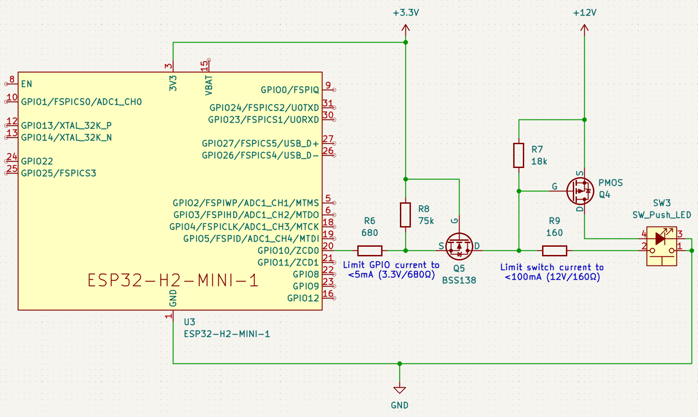

# Hardware Implementation — Component Selection and Dimensioning

## Electical Characteristics

The ESP32-H2 shows the following electrical GPIO characteristics
(see [Espressif: ESP32-H2 — Datasheet, sec. 2.2, "Pin Overview"](https://documentation.espressif.com/esp32-h2_datasheet_en.pdf)).

| Parameter | Description                      |            Min | Typ |            Max | Unit |
|:----------|:---------------------------------|---------------:|----:|---------------:|:-----|
| C(in)     | Input capacitance                |              — |   2 |              — | pF   |
| U(ih)     | High-level input voltage         | 0.75×Vdd = 2.5 |   — |  Vdd+0.3 = 3.6 | V    |
| U(il)     | Low-level input voltage          |           -0.3 |   — | 0.25×Vdd = 0.8 | V    |
| I(ih)     | High-level input current         |              — |   — |             50 | nA   |
| I(il)     | Low-level input current          |              — |   — |             50 | nA   |
| U(oh)     | High-level output voltage        |  0.8×Vdd = 2.6 |   — |              — | V    |
| U(ol)     | Low-level output voltage         |              — |   — |  0.1×Vdd = 0.4 | V    |
| I(oh)     | High-level output source current |                |  40 |                | mA   |
| I(ol)     | Low-level input sink current     |                |  28 |                | mA   |
| R(pu)     | Internal weak pull-up resistor   |              — |  45 |              — | kΩ   |
| R(pd)     | Internal weak pull-down resistor |              — |  45 |              — | kΩ   |

## Electrical Design of Input/Output Pins

We use **combined input/outputs** pins in **open-drain mode** with a **level shifter** and **high-side switching** of the loads as shown in the following high-level schematics.
See
[Penguin Tutor: Electronic Cicuit Design - MOSFET logic level shift](https://www.penguintutor.com/electronics/mosfet-levelshift)
and
[Stack Exchange: Understanding how This Bi-Directional Logic Level Shift Works](https://electronics.stackexchange.com/questions/555631/understanding-how-this-bi-directional-logic-level-shift-works)
for an in-depth explanation:
- Q5 acts as the level-shifter
- Q4 is the high-side switch

Pins that only realize input or output, the design omits the following components:
- Output-only pins: R9 is omitted
- Input-only pins: Q4 is omitted



_Note:_ This simplified schematics don't show any protective TVS diodes nor capacitors for debouncing.
**TBD:** The dimensions of the omitted capacitors and the resistors must be cross-checked with the PWM frequency.
The resistors must be sufficiently small such that they are able to charge/discharge the capacitors incl. the parasitic
capacitance of the MOSFETs.
The time constant of the resistors and combined capacitance's must be significantly smaller than the PWM frequency.

## Temporary Breadboard Calculation

This section has nothing to do with the final implementation.
This section is only a scratch board for some temporary calculations for the development setup on the breadboard. 

**Calculation for Input Pins**

```
 Vcc -- R1 -- S ---+----+-- In
                   |    |
                  R2    C
                   |    |
                  GND  GND
```

_(Backward) Calculation:_

- R1 + R2 = 5V/500µA = 10kΩ
- R2 / (R1 + R2) = 3V/5V = 0.6
- ⇒ R1 = 4kΩ, R2 = 6kΩ
- ⇒ R1 = 4.7kΩ, R2 = mid(10kΩ, 22kΩ) = 6.9kΩ, R2' = mid(10kΩ, 22kΩ, 45kΩ) = 5.9kΩ

_(Forward) Calculation:_

- Rges = 4.7kΩ + 6.9kΩ = 11.6kΩ, Rges' = 4.7kΩ + 5.9kΩ = 10.6kΩ
- Iges = 5V / 11.6kΩ = 431µA, Iges' = 5V / 10.6kΩ = 472µA
- U(ih) = 5V × 6.9kΩ / 11.6kΩ = 2.9V, U(ih)' = 5V × 5.9kΩ / 10.6kΩ = 2.78V

From https://www.mikrocontroller.net/articles/Entprellung

> Ein Taster prellt üblicherweise bis zu etwa 10 ms.
> Zur Sicherheit kann bei der Berechnung des Widerstandes eine Prellzeit von 20 ms angenommen werden.

**Calculation for Output Pins**

_(Backward) Calculation:_

Load path (I(drain) with LED):

- U(yellow) = 1.8V, U(red) = 1.6V
- I(led) = 10mA
- R(yellow) = (5V-1.8V)/10mA = 320Ω,  R(red) = (5V-1.6V)/10mA = 340Ω
- ⇒ R = 330Ω

Switching path (I(gate) from output pin):

- I(gs) = 100nA
- I(out,max) = 20mA
- I(out) = 1mA
- R(out) = 3.3V / 1mA = 3.3kΩ
- ⇒ R = 3.3kΩ