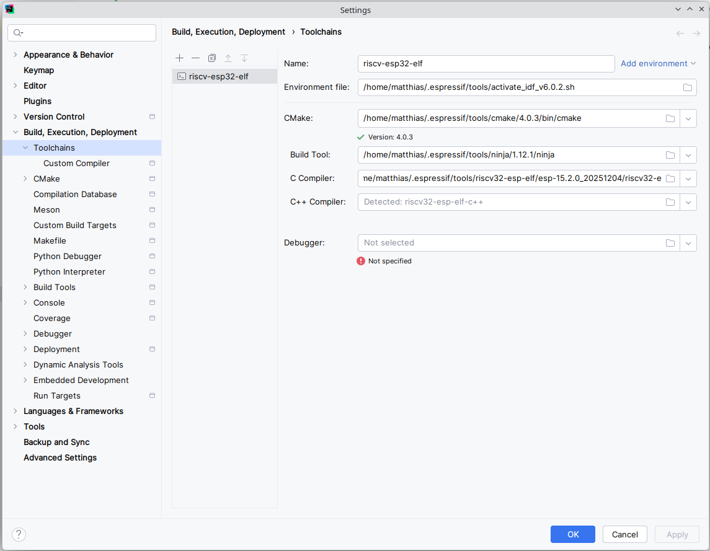
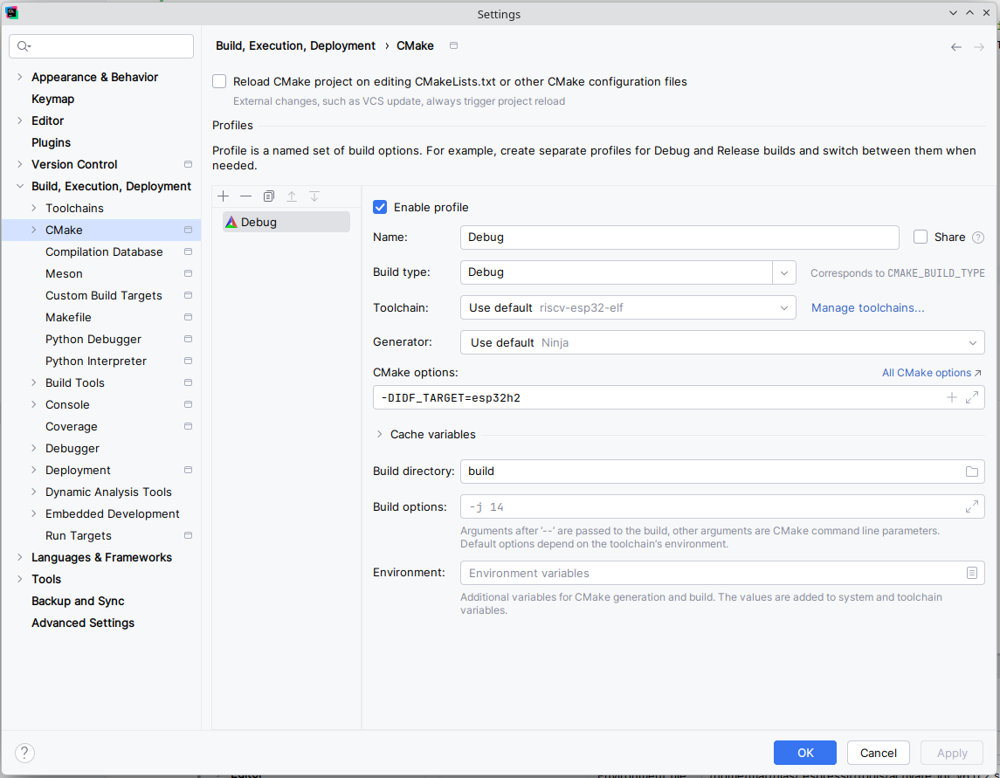

# Setting Up LionC

This guide is based on [Espressif Developer Portal: Working with ESP-IDF-in CLion](https://developer.espressif.com/blog/clion/).
This guide corrects the following errors:
- CLion must source `~/.espressif/tools/activate_idf_v6.0.2.sh` as part of the toolchain, not `~/.espressif/v6.0.2/esp-idf/export.sh`
- Path to build tools (CMake, Ninja, CC, etc.) must set explicitly, auto-detection will always use CLion’s built-in tools.

## Setting Up Toolchain for CLion

1. File -> Settings
2. “Build, Execution, Deployment” -> “Toolchains”
   1. Remove existing toolchain (if it exists)
   2. Create new toolchain "riscv-esp32-elf"
      - Add environment file: `~/.espressif/tools/activate_idf_v6.0.2.sh`
      - Set path to executables in `~/.espressif/tools/`
      - Debugger doesn’t work as version of included debugger is unsupported
   
3. “Build, Execution, Deployment” -> “CMake”
   1. Delete and create new or edit existing CMake profile
   2. Profile Settings
      - Name: Debug
      - Build type: Debug
      - Toolchain: Use default (riscv-esp32-elf)
      - Generator: Use default (Ninja)
      - CMake options: -DIDF_TARGET=esp32h2
      - Build directory: build
   

